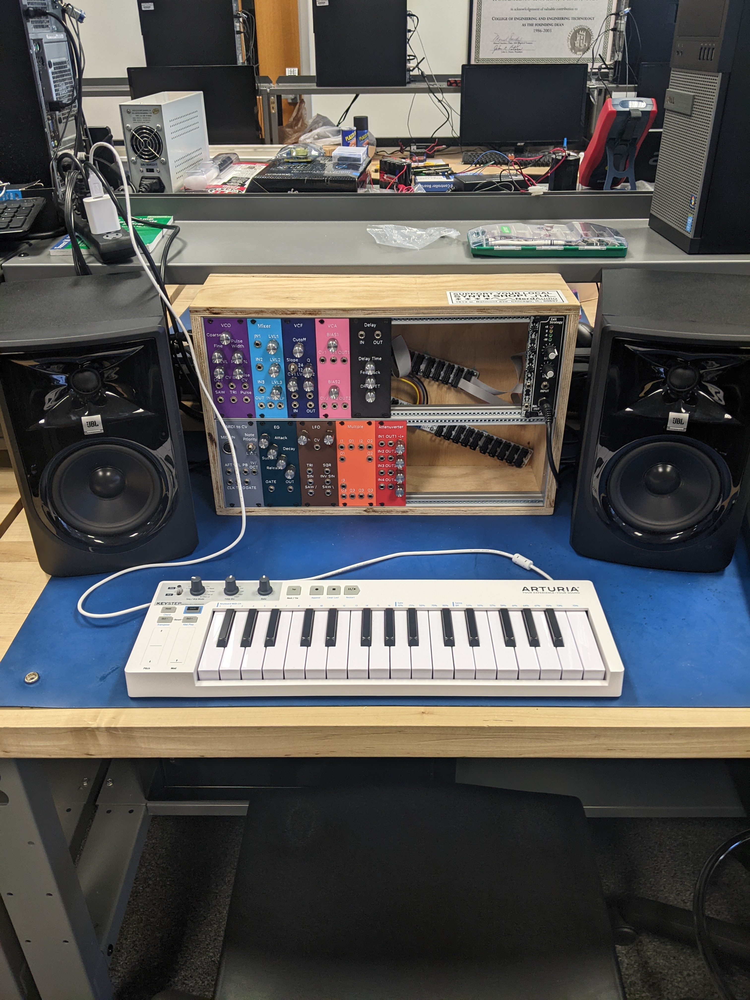

# NIU Senior Design 2022-2023 Group 33
Analog and Digital Controlled Modular Synthesizer for Audio Synthesis and Signal Processing

The goal of this project was to design and construct a modular Eurorack synthesizer.
The team has designed ten modules that perform the functions of a synthesizer. Those modules are:
- Musical Instrument Digital Interface (MIDI) to Control Voltage (CV)
- Voltage Controlled Oscillator (VCO)
- Voltage Controlled Amplifier (VCA)
- Voltage Controlled Filter (VCF)
- Envelope Generator (EG) ADSR Type
- Low Frequency Oscillator (LFO)
- Mixer
- Multiple
- Attenuverter
- Delay

# Schematics and PCBs
The schematic and board files for all ten modules can be found in the KiCad Schematics folder. In which, are folders for each of the modules. In addition to the KiCad project, schematic, and board files, there is a zip in each module folder which contains all the gerber files required to manufacture the PCBs. This group used JLCPCB, but any manufacture will do.

These files were made using KiCad version 7.0.1, release build

# Front Panels
This group chose to manufacture front panels using FDM 3D printing technologies. Step files can be found in the Steps folder for each of the modules. These files can be loaded into the slicer of your choice. Specifically, this group used Prusaslicer 2.6.0-alpha6 for the embossed text feature. Gcode can be found in the Gcode folder for each of the module front panels with text. The Gcode is for a Prusa i3 MK3S.
